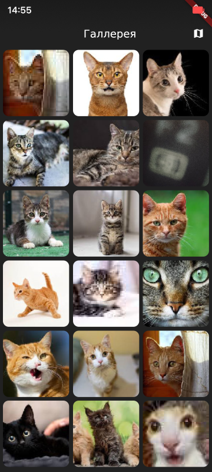
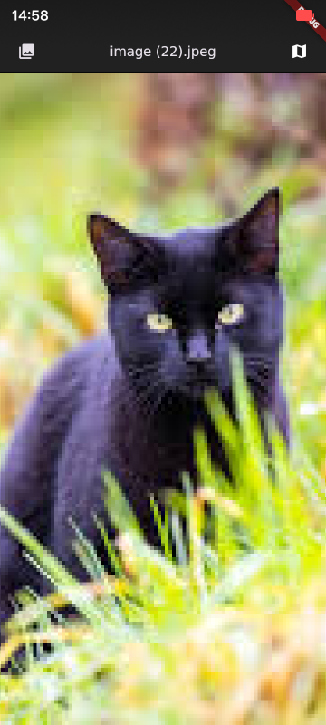
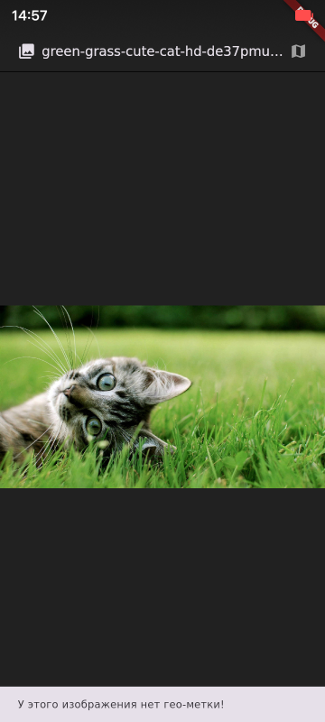
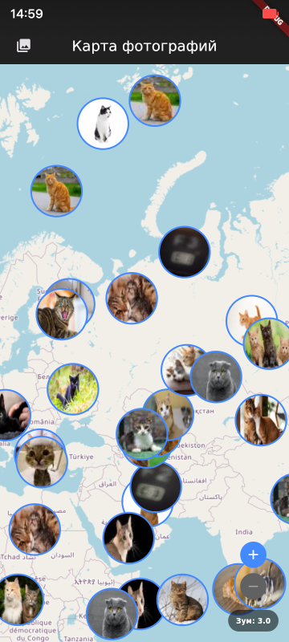
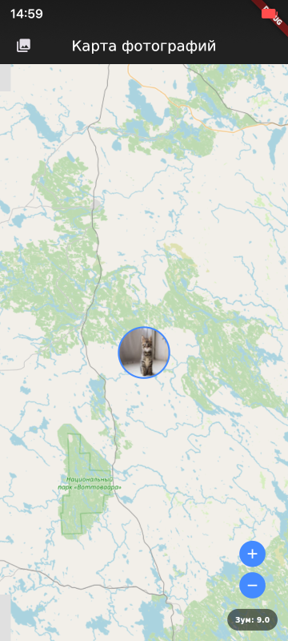
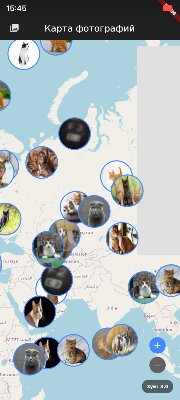

**RU** | [EN](README.md)

# ГеоАльбом

## Описание

Это приложение представляет собой функциональную мобильную фотогалерею для ОС Аврора, разработанную на Flutter. Приложение позволяет считывать геотеги из ваших фотографий и визуализировать их местоположение на интерактивной карте. Пользователи могут просматривать фотографии из директории `~/Pictures`, открывать их для детального просмотра и исследовать их географический контекст.

Проект демонстрирует несколько ключевых технических особенностей:

*   **Продвинутое управление состоянием:** Использует пакет `provider` для эффективного управления и распределения состояния приложения.
*   **Асинхронная обработка:** Применяет `compute` (изоляты) для выполнения "тяжелых" фоновых задач, таких как парсинг EXIF и генерация миниатюр, обеспечивая плавный и отзывчивый интерфейс.
*   **Оптимизация производительности:** Создает и кэширует легковесные, обрезанные до квадрата миниатюры изображений для быстрой и плавной прокрутки сетки.
*   **Оффлайн-карты:** Реализован кастомный `CachedTileProvider` для пакета `flutter_map`, который кэширует тайлы карты на устройстве. Это улучшает производительность и позволяет карте работать без активного интернет-соединения.
*   **Кастомная навигация:** Реализована система навигации на основе "машины состояний" (`HomeScreen` с условным построением), которая сохраняет состояние главных экранов при переключении между ними.

## Оглавление

*   [Особенности сборки](#особенности-сборки)
*   [Установка и запуск](#установка-и-запуск)
*   [Скриншоты](#скриншоты)
*   [Структура проекта](#структура-проекта)
*   [Добавление геометок к тестовым фото](#добавление-геометок-к-тестовым-фото)

<a name="особенности-сборки"></a>
## Особенности сборки

Перейдите в директорию проекта и сначала обновите зависимости:

```shell
flutter-aurora pub get
```

Чтобы собрать и запустить приложение:

```shell
flutter-aurora run
```

Чтобы запустить статический анализатор кода:

```shell
flutter-aurora analyze
```

<a name="установка-и-запуск"></a>
## Установка и запуск

Приложению требуются разрешения `UserDirs` (для доступа к `~/Pictures`) и `Internet` (для загрузки тайлов карты). Эти разрешения прописаны в файле `aurora/desktop/geo_album.desktop`.

Для тестирования приложения необходимо поместить ваши фото-файлы (JPEG, PNG) в папку `~/Pictures` на эмуляторе. Для работы функционала карты критически важно, чтобы эти фотографии содержали метаданные GPS (геометки).

<a name="скриншоты"></a>
## Скриншоты

*Обратите внимание: на скриншотах могут встречаться визуально идентичные изображения. Это является преднамеренной частью тестирования, так как приложение проверялось на обработку нескольких версий одного и того же файла с разным качеством и степенью сжатия.*

**Экран Галереи**  


**Просмотр (GPS есть)**  


**Просмотр (GPS нет)**  


**Карта (Все метки)**  


**Карта (Фокус на фото)**  


**Карта (Оффлайн из кэша)**  


<a name="структура-проекта"></a>
## Структура проекта

Проект имеет стандартную структуру приложения на Flutter для ОС Аврора.

*   **[aurora](aurora)**: Содержит исходный код на C++ и ресурсы, необходимые для сборки и установки на ОС Аврора.
*   **[lib](lib)**: Содержит весь исходный код на Dart.
    *   **[providers](lib/providers)**: Содержит бизнес-логику и управление состоянием.
    *   **[screens](lib/screens)**: Содержит UI для каждого из экранов приложения.
    *   **[utils](lib/utils)**: Содержит вспомогательные классы и функции.
    *   **[main.dart](lib/main.dart)**: Точка входа в приложение.
*   **[screenshots](screenshots)**: Содержит скриншоты приложения.
*   **[pubspec.yaml](pubspec.yaml)**: Описывает зависимости и метаданные проекта.
*   **[AUTHORS.md](AUTHORS.md)**: Список контрибьюторов проекта.
*   **[LICENSE](LICENSE)**: Содержит лицензию проекта (BSD-3-Clause).

<a name="добавление-геометок-к-тестовым-фото"></a>
## Добавление геометок к тестовым фото

Если ваши тестовые фотографии не содержат GPS-данных, вы можете добавить случайные геометки с помощью предоставленной утилиты на Python, доступной по ссылке ниже.

*   **Ссылка на утилиту:** [add_geotags.py](https://gitverse.ru/olegg000/add_geotags_util/content/master/add_geotags.py)

**Использование:**

1.  **Установите `exiftool`:**
    ```shell
    sudo apt install libimage-exiftool-perl
    ```
2.  **Скачайте и запустите скрипт:**
    ```shell
    python3 add_geotags.py
    ```
    Скрипт запросит путь к директории с вашими изображениями.